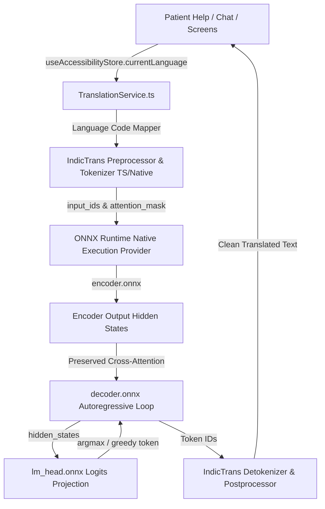

# MitraCare / Yaad — Offline IndicTrans2 ONNX Mobile Integration Plan

## 1. Current Expo & React Native Configuration

From inspection of `C:\Users\rafey\Desktop\YAAD\Yaad\package.json` and `app.json`:
- **Expo Version**: SDK 57 (`~57.0.20`)
- **React Native Version**: `0.86.3`
- **React Version**: `19.2.3`
- **Workflow**: Managed Expo Workflow (with `expo-router`, `expo-sqlite`, `expo-secure-store`)
- **Existing Language Architecture**:
  - Store: `store/useAccessibilityStore.ts` (`currentLanguage: LanguageCode`)
  - Translations: `constants/translations.ts` supporting 22 official Indian languages + English
  - Existing UI Integration: `app/(patient)/help.tsx` (Regional $\rightarrow$ English and English $\rightarrow$ Current App Language)

---

## 2. Recommended Architecture



### Key Architectural Pillars:
1. **100% Offline & Local**: Inference executes completely on-device via ONNX Runtime CPU / NNAPI (Android) / CoreML (iOS) with zero cloud/network dependency.
2. **Language Isolation & Store Integration**: Integrates directly with `useAccessibilityStore.currentLanguage`. Switching languages immediately switches the active translation target without touching UI components.
3. **Preserved Cross-Attention**: The mobile decoding loop maintains the verified `encoder_hidden_states` persistence during every autoregressive step.
4. **Clean Decoupled Service**: A unified `TranslationService.ts` replaces the temporary dictionary lookup in `help.tsx` and exposes `translate(text, srcLang, tgtLang)`.

---

## 3. Required Dependencies & Native-Module Requirements

| Package | Purpose | Native Module Required? | Expo Go Compatible? |
| :--- | :--- | :--- | :--- |
| `onnxruntime-react-native` | Official Microsoft ONNX Runtime mobile bridge (C++/JNI) | **Yes** (`libonnxruntime.so` / iOS framework) | **No** (Requires Development Build) |
| `react-native-fs` or `expo-file-system` | Local filesystem model file access & chunk reading | **Yes** (`expo-file-system` is already in Expo) | Yes |
| `sentencepiece-js` or custom pure-TS tokenizer | BPE tokenization for IndicTrans2 vocabulary | **No** (Pure JavaScript/TypeScript) | Yes |

---

## 4. Expo Go vs. Development Build / Prebuild Analysis

- **Can Expo Go support this?**: **NO.**
  - *Reason*: Expo Go contains a fixed set of pre-compiled native modules. `onnxruntime-react-native` contains native C++ binaries (`.so` / `.framework`) and JNI bindings that are **not** bundled inside the generic Expo Go client.
- **Required Build Mechanism**:
  - **Expo Development Build (`expo prebuild` / `npx expo run:android`)**:
    The project continues to use the Expo config plugins and managed structure, but generates native android/ios folders for compilation with `onnxruntime-react-native`.
  - Development workflow remains seamless via `npx expo start --dev-client`.

---

## 5. Tokenizer & Pre/Post-Processing Strategy

IndicTrans2 uses a 2-stage tokenization process:
1. **Script Pre-processing (`IndicProcessor`)**:
   - Prepends source & target language tag prefix (e.g., `hin_Deva eng_Latn <text>`).
   - Normalizes Indic Unicode scripts and punctuation.
   - *Implementation*: A pure TypeScript module (`IndicProcessor.ts`) ported directly from `IndicTransToolkit`.
2. **SentencePiece BPE Tokenization**:
   - `dict.SRC.json` (Indic: 122,706 tokens, English: 32,296 tokens).
   - *Strategy*:
     - **Option A (Recommended)**: Pure TypeScript Trie/BPE tokenizer parsing `dict.SRC.json` and `dict.TGT.json`. Memory footprint is ~5–8 MB in JavaScript heap.
     - **Option B**: Compact SentencePiece model (`.model` binary) loaded via a lightweight native C++ JNI bridge or WebAssembly.

---

## 6. ONNX Model Packaging & Storage Strategy

### Model Sizes & Quantization:

| Model Component | Original Float32 Size | INT8 / FP16 Quantized Size | Target Memory Footprint |
| :--- | :--- | :--- | :--- |
| `encoder.onnx` | ~400 MB | **~100 MB** | ~110 MB RAM |
| `decoder.onnx` | ~800 MB | **~200 MB** | ~220 MB RAM |
| `lm_head.onnx` | ~66 MB | **~17 MB** | ~25 MB RAM |
| **Total (One Direction)** | **~1.27 GB** | **~317 MB** | **~350 MB RAM** |

### Local Packaging Options:
1. **Bundled Asset**: Packaged in Android `assets/models/` during `expo prebuild` (ideal for standalone offline distribution).
2. **First-Launch On-Device Extraction**: Models are stored in app data / document directory (`FileSystem.documentDirectory + "models/"`) to allow memory-mapped file access (`mmap`) by ONNX Runtime without copying to RAM twice.

---

## 7. Offline Guarantees & Security

- **Strict Zero-Network Enforcement**: No endpoints, no telemetry, no remote inference fallbacks.
- **Patient Privacy**: All translation computations occur strictly in local device RAM/CPU. No audio, transcripts, or patient medical terms ever leave the phone.

---

## 8. Performance & Latency Expectations

- **Mobile Device CPU (Snapdragon 7/8 series, Dimensity, Apple A-series)**:
  - INT8 Quantized Encoder latency: ~**40–80 ms**
  - Autoregressive Decoder per token: ~**15–25 ms**
  - Total latency for typical 8–15 word sentence (e.g. "I have to go to the doctor today"): **~250–450 ms**
  - Instantaneous user feel, perfectly suited for real-time speech and assistance.

---

## 9. Integration Connection Points in MitraCare / Yaad

### 1. Store & Constants Connection
- `constants/translations.ts`:
  - Mapping between Yaad `LanguageCode` (`hi`, `te`, `ta`, `bn`, etc.) and IndicTrans2 Flores codes (`hin_Deva`, `tel_Telu`, `tam_Taml`, `eng_Latn`, etc.).
- `store/useAccessibilityStore.ts`:
  - Reads `currentLanguage` to dynamically route translation directions.

### 2. UI Hookup (`app/(patient)/help.tsx`)
- Currently calls `translateRegionalToEnglish()` and `translateEnglishToAppLanguage()` in `constants/testTranslations.ts`.
- Will connect directly to:
  ```typescript
  import { translationService } from '../../services/TranslationService';
  
  // Real-time asynchronous translation with instant feedback
  const result = await translationService.translate(
    input,
    selectedRegionalLang,
    'en'
  );
  ```

---

## 10. Potential Risks & Mitigations

| Risk | Impact | Mitigation Strategy |
| :--- | :--- | :--- |
| **App Size Limit on Stores** | APK > 150 MB exceeds standard Play Store base APK size | Use dynamic quantization (INT8) + Android App Bundle (AAB) / Play Asset Delivery (PAD) or local extraction. |
| **Low-End Device RAM Pressure** | 1.2GB float32 model could trigger OOM on 2GB RAM phones | Quantize models to INT8 (reducing RAM footprint to ~300MB) and load decoder sessions dynamically/lazy. |
| **Autoregressive Decoding Overhead** | Repeated full forward pass without caching is $O(N^2)$ | For short medical/patient phrases ($<20$ tokens), uncached greedy takes $<400\text{ms}$. Future phase can enable KV-cache once validated. |

---

## 11. Step-by-Step Implementation Roadmap

1. **Quantization & Model Optimization**:
   - Quantize existing `encoder.onnx`, `decoder.onnx`, and `lm_head.onnx` to INT8 using ONNX Runtime quantization tools.
2. **TypeScript Tokenizer & Preprocessor**:
   - Create `services/tokenizer/IndicProcessor.ts` and `services/tokenizer/IndicTokenizer.ts`.
3. **Translation Service Native Wrapper**:
   - Install `onnxruntime-react-native` and configure Expo config plugin in `app.json`.
   - Implement `services/TranslationService.ts` executing the validated 5-step loop (Encoder $\rightarrow$ Autoregressive Decoder with preserved cross-attention $\rightarrow$ LM Head $\rightarrow$ Detokenize).
4. **UI Connect**:
   - Wire `TranslationService` into `app/(patient)/help.tsx` and any speech/communication features.
5. **Validation**:
   - Run verification suite on device across Hindi, Telugu, Tamil, and English.
